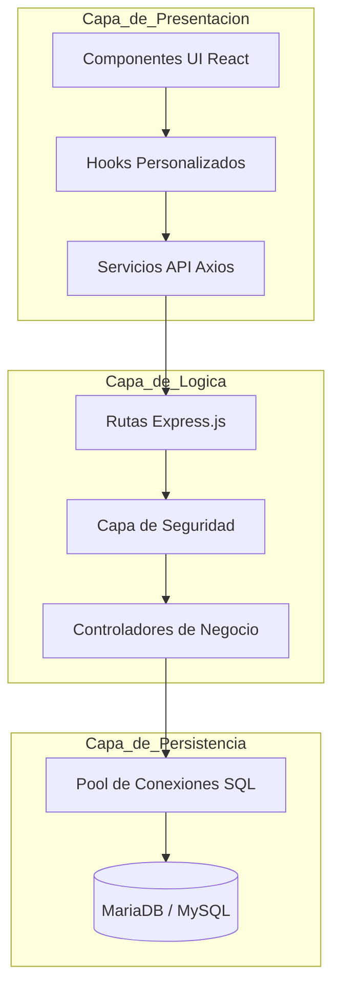

# Plataforma de Gestión Deportiva - PGD Itagüí

## Introducción Técnica
La Plataforma de Gestión Deportiva (PGD) es una solución empresarial de Data Governance y Control Operativo desarrollada específicamente para las necesidades del Instituto Municipal de Cultura, Recreación y Deporte de Itagüí. El sistema implementa una arquitectura robusta para la administración centralizada de activos públicos, optimizando la asignación de recursos humanos y la planificación de infraestructuras deportivas a través de una interfaz de alta precisión y un núcleo de datos íntegro.

## Arquitectura del Sistema
El ecosistema tecnológico se fundamenta en un diseño monolítico modular bajo estándares de Separación de Responsabilidades (SoC). Esta estructura garantiza un desacoplamiento efectivo entre la capa de presentación y la lógica de negocio, facilitando la escalabilidad horizontal y la futura transición hacia microservicios si la demanda operativa lo requiere.

### Diagrama de Flujo de Datos

## Componentes de Ingeniería y Calidad
1. Integridad de Tipos: El proyecto está implementado íntegramente en TypeScript, lo que reduce el error humano en tiempo de ejecución y establece contratos de datos estrictos en toda la pila tecnológica.
2. Gestión Transaccional: Las operaciones críticas de persistencia, especialmente en la actualización masiva de turnos operativos, están encapsuladas en transacciones SQL para asegurar la atomicidad y evitar estados de datos inconsistentes.
3. Modularización UI: La interfaz se compone de elementos atómicos y componentes de propósito único, extrayendo la lógica de estado compleja hacia hooks dedicados y utilidades de procesamiento de datos externas.

## Seguridad y Control de Acceso
El sistema implementa un modelo de Control de Acceso Basado en Roles (RBAC) con dos niveles principales de privilegios: Administrador y Operador.
- Autenticación: Gestión de sesiones a través de express-session con almacenamiento persistente en el servidor y mecanismos de seguridad en las cookies de cliente.
- Autorización: Middleware especializado verifica las capacidades del usuario antes de ejecutar operaciones de escritura o acceso a módulos sensibles.
- Integridad Temporal: Implementación de una política de normalización de fechas que mitiga discrepancias horarias mediante el uso de offsets controlados, asegurando que los reportes semanales sean coherentes independientemente del huso horario del cliente.

## Módulos Funcionales
### Administración de Horarios Operativos
- Programación Dinámica: Algoritmo de navegación semanal que permite la persistencia de históricos y la proyección de turnos futuros.
- Motor de Exportación: Extensión específica para la generación de reportes en formato XLSX con personalización de estilos CSS-in-JS, asegurando reportes corporativos legibles y precisos.
- Análisis de Cobertura: Herramientas visuales para la identificación de vacantes operativas basadas en la disponibilidad del pool de gestores.

### Gestión de Reservas e Infraestructura
- Calendario Interactivo: Integración de FullCalendar optimizada para el renderizado eficiente de grandes volúmenes de eventos.
- Lógica de Recurrencia: Capacidad de registrar sesiones periódicas con validación automática de conflictos de horario para evitar duplicidad de reservas en un mismo escenario.

## Estrategia de Escalabilidad Futura
Para asegurar la viabilidad técnica del sistema a largo plazo, se han definido los siguientes ejes de evolución:
1. Observabilidad y Monitoreo: Integración de herramientas de registro estructurado (Winston) y seguimiento de errores en producción (Sentry).
2. Optimización de Lectura: Implementación de una capa de caché en memoria mediante Redis para acelerar la recuperación de horarios y estados de disponibilidad.
3. Repositorio Multimedia Centralizado: Migración del almacenamiento de archivos local hacia servicios de almacenamiento de objetos como Amazon S3 o Cloudinary, permitiendo una gestión más eficiente de evidencias gráficas.
4. Pirámide de Pruebas: Incorporación de pruebas unitarias para utilidades de cálculo y pruebas de integración para los flujos de autenticación y reserva.

## Stack Tecnológico Detallado
LENGUAJE Y ENTORNO
- TypeScript 5+
- Node.js LTS

FRONTEND
- React 18
- Vite
- Tailwind CSS
- Lucide React

BACKEND
- Express.js
- Express Session
- Morgan / Helmet

BASE DE DATOS
- MySQL 8.0+ / MariaDB

---
Documentación técnica oficial. Desarrollado con estándares de ingeniería para la gestión pública eficiente.
