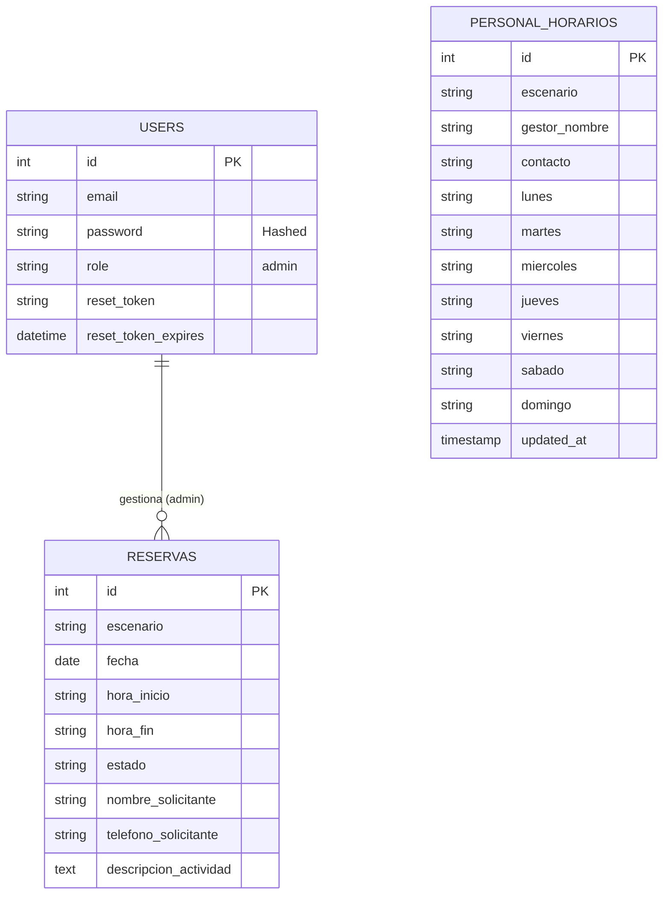

# Modelo Entidad-Relación (MER)

Este diagrama representa la estructura de la base de datos del sistema PGD.

## Diccionario de Datos Simplificado

| Tabla | Descripción |
| :--- | :--- |
| **users** | Almacena credenciales de acceso para administradores y empleados. |
| **reservas** | Registro centralizado de solicitudes de espacios deportivos. |
| **personal_horarios** | Malla de turnos y contacto de los gestores de cada escenario. |
