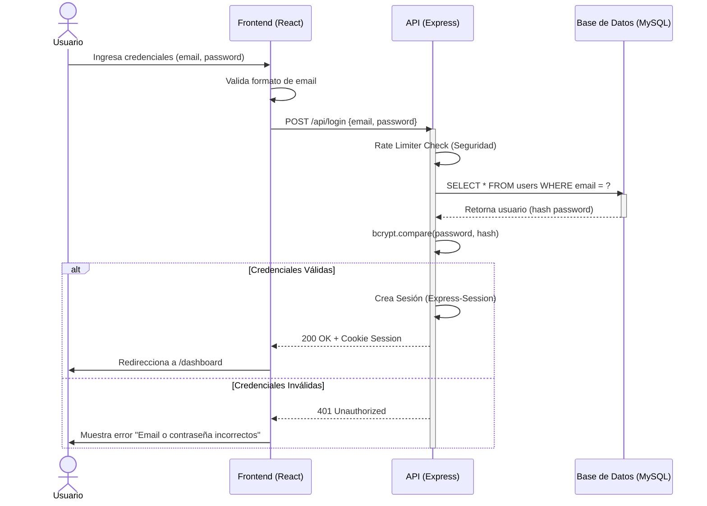

# Diagrama de Secuencia: Autenticación (Login)

Este diagrama detalla el flujo de mensajes entre el Usuario, el Frontend y el Backend durante el proceso de inicio de sesión.

```mermaid
sequenceDiagram
    actor User as Usuario
    participant FE as Frontend (React)
    participant API as API (Express)
    participant DB as Base de Datos (MySQL)

    User->>FE: Ingresa credenciales (email, password)
    FE->>FE: Valida formato de email
    FE->>API: POST /api/login {email, password}
    activate API
    API->>API: Rate Limiter Check (Seguridad)
    API->>DB: SELECT * FROM users WHERE email = ?
    activate DB
    DB-->>API: Retorna usuario (hash password)
    deactivate DB
    
    API->>API: bcrypt.compare(password, hash)
    
    alt Credenciales Válidas
        API->>API: Crea Sesión (Express-Session)
        API-->>FE: 200 OK + Cookie Session
        FE->>User: Redirecciona a /dashboard
    else Credenciales Inválidas
        API-->>FE: 401 Unauthorized
        FE->>User: Muestra error "Email o contraseña incorrectos"
    end
    deactivate API
```
